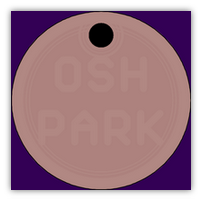
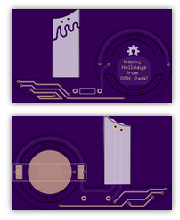
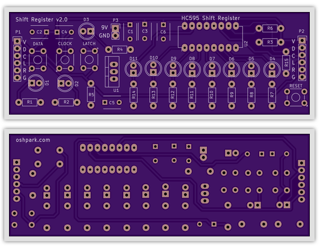
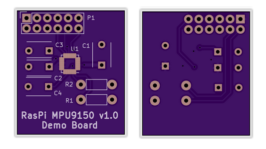
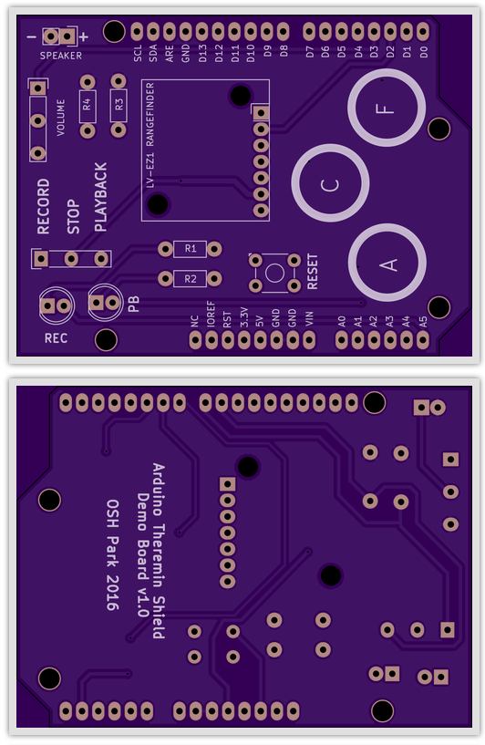

# Boards
For all our general board development projects.  Make subdirectories per project.

### Tokens

Gerbers and Eagle files for 4-layer tokens/pendants. Copy `base` into a new folder to make a new design. $22.60 for three.

### Holiday Candleholders

Holiday board. Gerbers and Eagle files for 2-layer holiday candleholders using a flickering LED, a 1/4W through-hole resistor, and a CR2032 coin cell battery holder. $19.90 for three. 

### Shift Register Demo

Conference demo board. Gerbers and KiCad files for 2-layer shift register demo board. Started by Laen, extended by Jenner. $28.85 for three.

### RasPi MPU9150 Breakout Board

Conference demo board. Gerbers and KiCad files for 2-layer breakout board for MPU9150 that fits inside a clear RasPi case. $6.20 for three. 

### Arduino Theremin

Conference demo board. Gerbers and KiCad files for 2-layer Arduino Uno R3 shield. Play musical notes by placing your hand above a rangefinder; change the key by touching capacitive sense pads. $29.50 for three.

