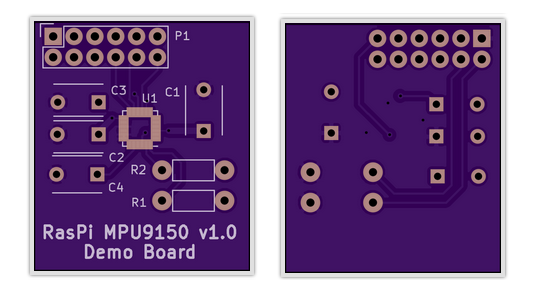

# RasPi MPU9150 Breakout Board

An IMU MPU9150 breakout board that fits inside a RasPi case.

|Refdes|Qty|Description|Digikey|
|------|---|-----------|-------|
|C1|1|CAP CER 10000PF 50V X7R RADIAL|BC2662CT-ND|
|C2,C3|2|CAP CER 0.1UF 50V C0G RADIAL|445-8532-ND|
|C4|1|CAP CER 2200PF 50V X7R RADIAL|445-5248-ND|
|P1|1|PPTC062LFBN-RC|S7074-ND|
|R1,R2|1|RES 10K OHM 1/4W 5% CF MINI|S10KQCT-ND|
|U1|1|GYRO/ACCELEROMETER 9-AXIS 24LGA|1428-1009-1-ND|
