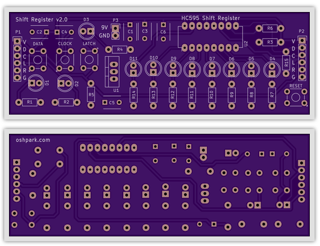

# Shift Register Demo v2

Extending an existing shift register demo board that Laen started. 

|Refdes|Qty|Description|Digikey|
|------|---|-----------|-------|
|C1|1| CAP CER 0.33UF 50V X7R RADIAL|445-5263-ND|
|C3,C6|2|CAP CER 0.1UF 50V C0G RADIAL|445-8532-ND|
|C2,C4,C5|3|CAP CER 1UF 16V X7R RADIAL|445-8614-ND|
|D1-D3|3|LED GRN DIFF 5MM ROUND T/H|1125-1184-ND|
|D4-D11|8|LED RED DIFF 5MM ROUND T/H|1125-1188-ND|
|P1|1|6POS FEMALE R/A 0.1" HEADER|S5481-ND|
|P2|1|6POS MALE R/A 0.1" HEADER|S1111EC-06-ND| 
|R1,R2,R4,R6,R15|5|RES 1K 1/4W 5% CF MINI|S1KQCT-ND|
|R3|1|RES 82K 1/4W 5% CF MINI|S82KQCT-ND|
|R5|1|RES 18K 1/4W 5% CF MINI|S18KQCT-ND|
|R7-R14|8|RES 150 1/4W 5% CF MINI|S150QCT-ND|
|SW1-SW4|4|SWITCH TACTILE SPST-NO 0.05A 24V|SW400-ND|
|U1|1|7805 IC REG LDO 5V 1A TO220AB|NCP7805TGOS-ND|
|U2|1|HC595 IC SHIFT REG 8BIT 16DIP|568-1484-5-ND|
